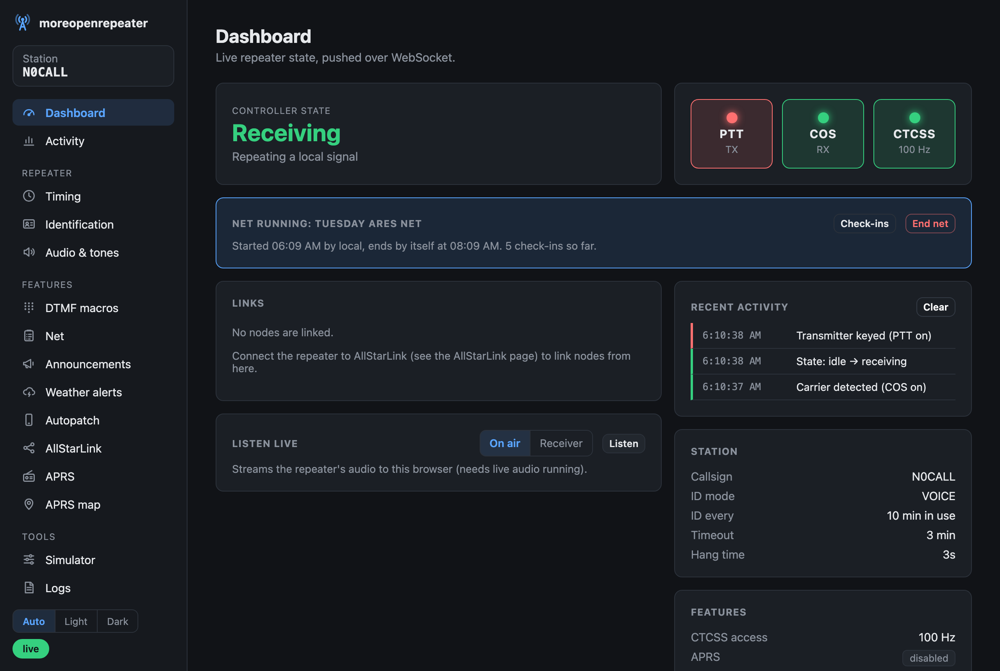
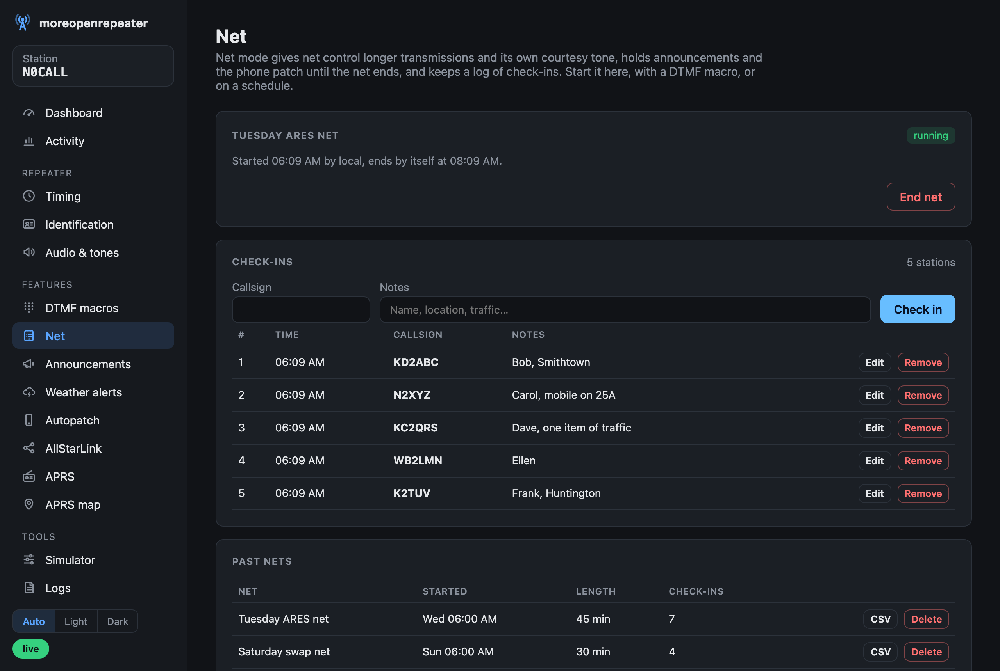
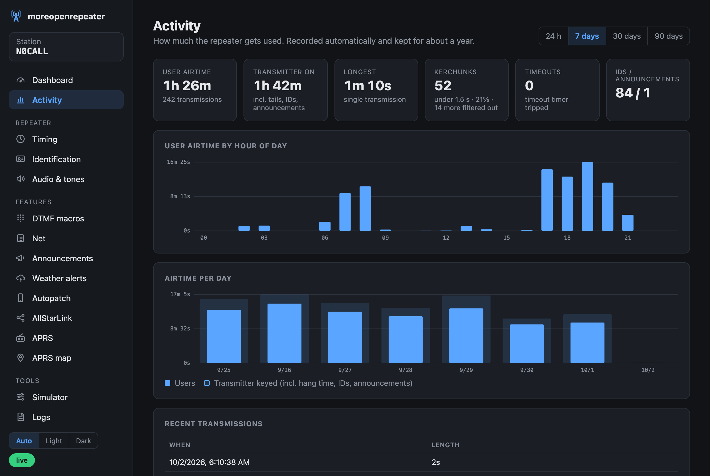
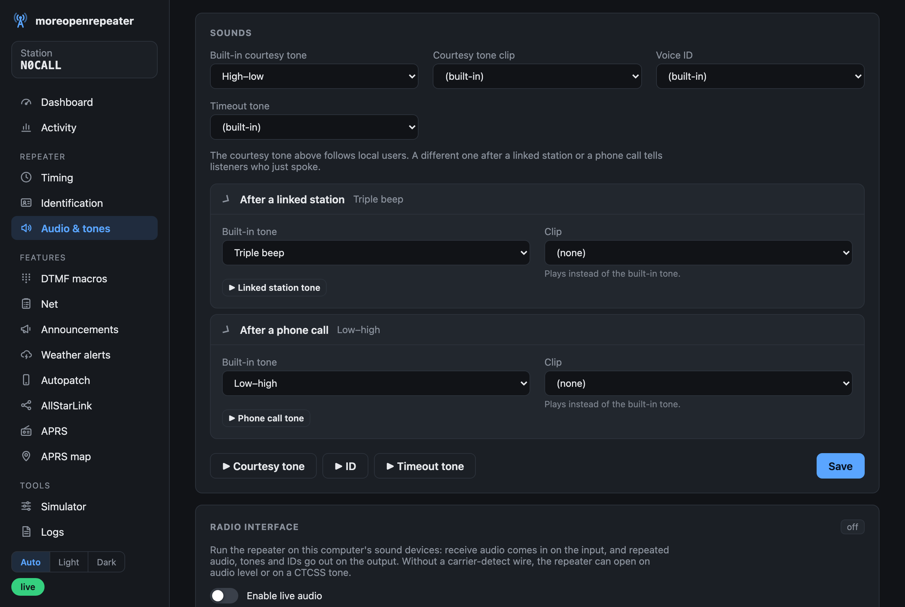
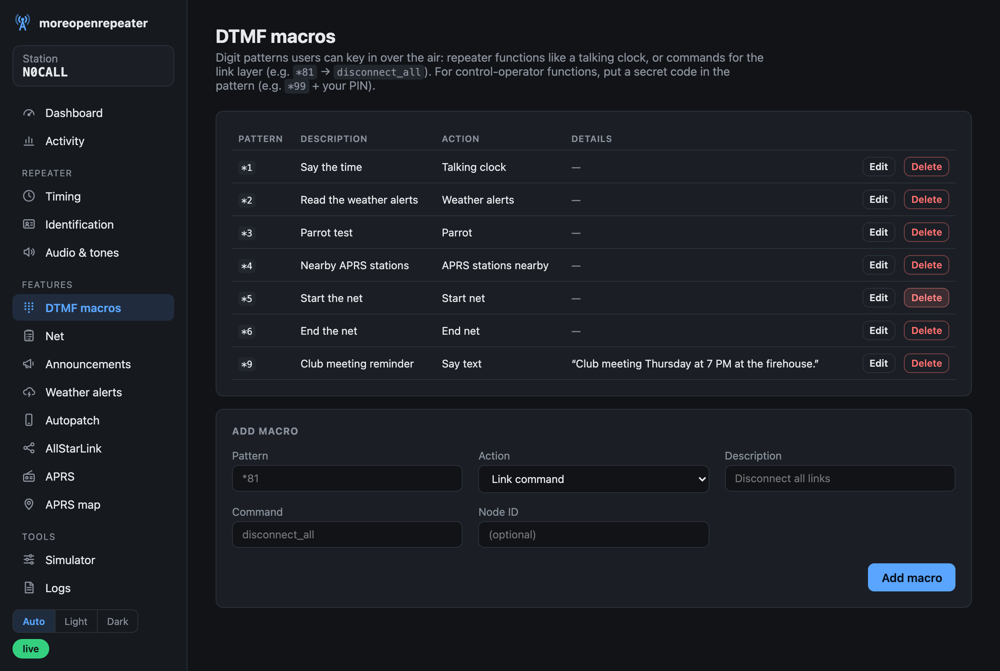
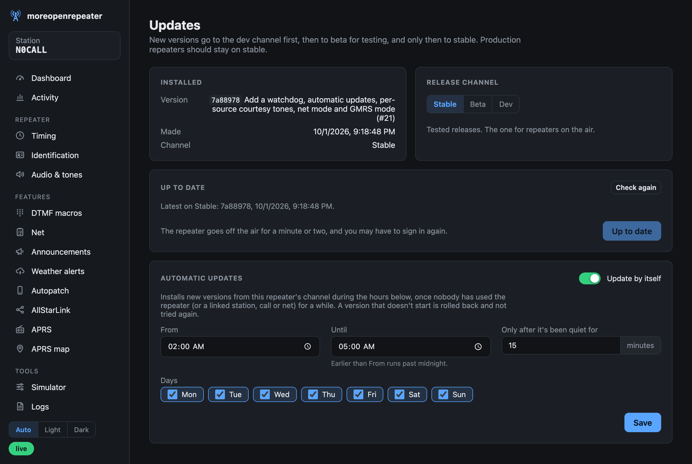
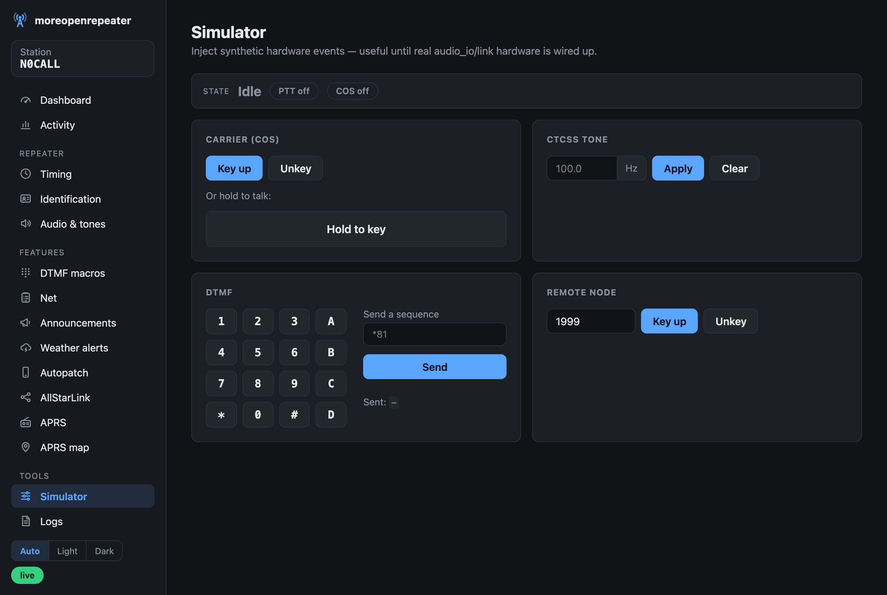

# moreopenrepeater

A modern, Python-native ham radio repeater controller for Raspberry Pi --
a from-scratch reimagining of [OpenRepeater](https://github.com/OpenRepeater/openrepeater)
with custom repeater-control logic (not a wrapper around Asterisk's `app_rpt`).

## Screenshots

The dashboard, with a station transmitting while a net is running:



<table>
  <tr>
    <td width="50%"></td>
    <td width="50%"></td>
  </tr>
  <tr>
    <td><b>Net mode</b>: check-ins logged during the net, past nets downloadable as CSV.</td>
    <td><b>Activity</b>: airtime by hour and by day, kerchunks, timeouts and IDs.</td>
  </tr>
  <tr>
    <td></td>
    <td></td>
  </tr>
  <tr>
    <td><b>Courtesy tones</b>: one each for local users, linked stations and phone calls, with previews.</td>
    <td><b>DTMF macros</b>: over-the-air commands, from a talking clock to starting a net.</td>
  </tr>
  <tr>
    <td></td>
    <td></td>
  </tr>
  <tr>
    <td><b>Updates</b>: stable, beta and dev channels, and automatic updates overnight.</td>
    <td><b>Simulator</b>: try the controller with no radio attached.</td>
  </tr>
</table>

## Architecture

- **`dsp`** -- CTCSS/DTMF Goertzel-algorithm tone decode and encode. Pure
  functions/classes over numpy arrays; no I/O, no threads.
- **`controller`** -- the repeater state machine (idle / receiving /
  courtesy tone / hang time / timeout / transmitting ID), the DTMF
  command-macro dispatcher, and the timeout/hang/ID timers. Driven entirely
  by plain-data events and commands (`src/controller/events.py`) -- it has
  no knowledge of audio hardware or the network link, so it's testable with
  synthetic event sequences and a fake clock (`handle_event(event, now)` /
  `tick(now)`, no real `time.sleep`).
- **`audio_io`** -- sounddevice stream lifecycle (`AudioStream`/
  `AudioBlockPump`, a disciplined non-blocking PortAudio callback that only
  moves numpy blocks through queues) and a CM108-family USB sound-card GPIO
  driver (`CM108Interface`) for PTT output, COS input and the spare pins,
  following AllStarLink's chan_simpleusb and direwolf (a hidraw output-report
  write carrying every output pin, and the input report read on demand with
  HIDIOCGINPUT; COS on the VOL_DN input, active low). Linux-only at the hardware
  layer (`/dev/hidrawN`); the GPIO bit-packing logic is unit tested via a
  fake in-memory device, no real hardware required. `AudioProcessor` is the
  per-20 ms-block logic of a live repeater (software COS by audio level,
  CTCSS or an external pin; DTMF; repeat audio with TX gain; clip playback),
  with no threads or devices so it's tested on synthetic signals.
  `AudioEngine` runs it against real devices: the PortAudio callback only
  moves blocks, a worker thread does the processing, and PTT follows what
  is actually being transmitted.
- **`playout`** -- turns the controller's `PlayAudio` clip names into samples:
  courtesy/timeout tones, CW or text-to-speech IDs (`say`, `espeak-ng` or
  `pico2wave`, whichever is installed), uploaded clips, and spoken
  announcements. Rendered clips are cached, so the controller knows each
  clip's real length and the live engine can start it without delay.
- **`wx`** -- National Weather Service active-alert polling
  (`api.weather.gov`), severity filtering and alert-to-speech text.
- **`link`** -- bridges to a local Asterisk + `app_rpt` sidecar process
  (used only as the AllStarLink/IAX2 network transport) via `AMIClient`
  (control events/actions) and `link.audiosocket` framing (raw PCM audio).
  **Verified against a real AllStarLink ASL3 instance** (Debian 12 arm64
  Lima VM -- see `spikes/audiosocket_asl3_spike.py` for the reproducible
  setup): `AMIClient` connects, logs in, sends actions, and reads events
  against live Asterisk; `link.audiosocket`'s framing correctly parses the
  UUID handshake from real `chan_audiosocket`, and proactively sending
  audio (mirroring how `audio_io` will behave in practice) satisfies
  `app_audiosocket.c`'s 2-second keep-alive requirement. This spike also
  caught a real bug: Asterisk interleaves unsolicited Events with action
  Responses on the same connection (e.g. a `FullyBooted` event landing
  right after login, ahead of the next action's response), which broke a
  naive "read the next message and assume it's the response" client --
  fixed by correlating responses via `ActionID` instead of read-order (see
  `tests/link/test_ami_client.py`'s interleaving regression test).
  `link.node_link.NodeLinkClient` bridges a real app_rpt node's AMI events
  to `controller.events` and back: it consumes `RPT_ALINKS` (re-triggered by
  app_rpt on every link connect/disconnect *and* every keyed-state flip --
  confirmed against app_rpt's own source, `apps/app_rpt/rpt_link.c`'s
  `rpt_update_links`/`__mklinklist`, and a live two-node link/unlink test)
  and diffs successive snapshots into `LinkStateChanged`/`RemoteKeyed`
  events; `SendLinkCommand` (from a matched DTMF macro) goes back out as an
  AMI `Command` action running `rpt fun <node> <command>` -- see
  `spikes/node_link_ami_spike.py` for the reproducible two-node setup this
  was verified against. Two more real bugs turned up doing this: (1)
  `AMIClient` silently kept only the last line of a multi-line `Command`
  response (e.g. `rpt stats`) because repeated `Output:` header lines
  overwrote each other in a plain dict -- fixed to collect repeats into a
  list; (2) FastAPI runs synchronous (`def`) path operations in a worker
  thread with no asyncio event loop, so the `SendLinkCommand` sink's
  `asyncio.create_task` call from inside `POST /api/simulate/dtmf` raised
  `RuntimeError: no running event loop` the first time a macro actually
  fired for real -- fixed by converting every request handler that mutates
  `RepeaterService` to `async def`, which is what actually gives them the
  "same event loop, no locking needed" guarantee `RepeaterService` was
  already documented (but not enforced) to rely on.
  The node's audio goes over app_rpt's USRP channel
  (`rxchannel = USRP/...`, `link.usrp` and `api.allstar_audio`). The
  controller is the node's radio: what it repeats goes out over the links,
  and what the node transmits keys the repeater. `rxchannel = AudioSocket/...`
  can't do this, because AudioSocket carries only audio and app_rpt needs
  key-up signalling for its receiver. Verified both ways against ASL3; see
  [docs/allstar.md](docs/allstar.md).
- **`api`/`web`** -- FastAPI backend (`RepeaterService` runs a
  `RepeaterController` in-process on the asyncio event loop) exposing REST
  config/status endpoints, a `/ws/status` WebSocket pushing live state on
  every change, and `simulate_*` endpoints (COS/CTCSS/DTMF/remote-node-keyed)
  that inject synthetic events -- a dev/demo aid for whichever of
  `audio_io`/`link` isn't wired into a given deployment yet. `link` *is* now
  wired in for real: set `MOREOPENREPEATER_AMI_HOST` (+ `_PORT`/`_USER`/
  `_SECRET`/`_NODE`) and `create_app` starts a background task that connects
  `NodeLinkClient` to the local app_rpt node, feeds its translated events
  into `RepeaterService.handle_link_event`, and dispatches DTMF-macro
  `SendLinkCommand`s back out over the same connection -- reconnecting
  every 5s on a dropped connection. Deliberately not part of `RepeaterConfig`/
  the dashboard: AMI credentials are a deployment secret, not something a
  browser client should be able to read back via `GET /api/config`.
  `audio_io` is wired in too: `api.live_audio.LiveAudio` starts the
  `AudioEngine` when live audio is enabled on the dashboard, feeds detected
  carrier/CTCSS/DTMF into the controller, and carries out its PTT and clip
  commands (a CM108 plugged in at startup adds hardware PTT/COS).
  The `simulate_*` controls keep working alongside it.
  Frontend (`web/`) is a plain HTML/JS dashboard (no build step) served by
  FastAPI's StaticFiles, driven by that same WebSocket. Manually verified
  live: COS key-up correctly drives the state machine through `receiving`
  with a real-time push to the dashboard, config load/save round-trips
  through the REST API, and -- against the real Lima VM -- a real AMI
  connect/disconnect updated the dashboard's linked-nodes indicator live
  over the WebSocket in both directions, and a real DTMF macro reconnected
  two live app_rpt nodes (confirmed via the VM's own `rpt stats` DTMF
  counter and `Nodes currently connected to us` field).

## Feature parity with OpenRepeater

Researched OpenRepeater's actual feature set (it's SVXLink-based with EchoLink-only
linking, not Asterisk/AllStar as we'd assumed) and are porting the useful bits in over
several phases (see the plan file for the full breakdown):

- **Phase A -- CW/Morse ID (done)**: `dsp/morse.py` generates a standard PARIS-timing
  keyed CW tone from text; `RepeaterConfig` gained `callsign`, `id_mode`
  (`voice`/`cw`/`both`), `cw_wpm`, `cw_tone_hz`, exposed through the config API/
  dashboard form. `controller`'s `_enter_id` is unchanged -- it still just emits
  `PlayAudio(clip="id")`, and `playout.renderer` decides how that clip sounds.
- **Phase B -- DTMF macro management (done)**: `controller.macros.Macro` changed from
  holding a Python callable to plain JSON-serializable fields (`pattern`, `description`,
  `command`, `node_id`) so macros can be created/edited through the API, not just at
  Python startup; `RepeaterController.list_macros`/`set_macros` delegate to the
  decoder so callers never reach into private state. Dashboard gained a macros table
  with add/delete, backed by `GET/POST /api/macros` and `DELETE /api/macros/{pattern}`
  (adding a macro with an existing pattern replaces it). Manually verified live:
  add-macro form submit, and the table's delete button, both round-trip through the
  real API.
- **Phase C -- config/macro backup-restore snapshots (done)**: `RepeaterService.
  export_snapshot`/`import_snapshot` round-trip config + macros as a plain JSON dict,
  exposed via `GET`/`POST /api/snapshot`. Dashboard has "Download configuration" (native
  Blob-URL download) and a file-upload input that POSTs the parsed JSON back.
- **Phase D -- audio asset upload/management (done)**: `api.assets.AudioAssetStore` is
  a filesystem-backed store (`data/audio/<id>.wav` + a JSON sidecar index, no database)
  for uploaded courtesy-tone/ID/timeout-tone/custom clips, exposed via `GET/POST
  /api/assets`, `DELETE /api/assets/{id}`, and `GET /api/assets/{id}/audio` (multipart
  upload -- added `python-multipart` as a dependency). `RepeaterConfig` gained
  `courtesy_tone_asset_id`/`id_asset_id`/`timeout_tone_asset_id`, which the renderer
  uses in place of the built-in sounds. Dashboard has an upload form, a table with inline
  `<audio controls>` preview and delete, and the three config dropdowns populate from
  the live asset list. Manually verified live: uploaded a real .wav through the API,
  confirmed it rendered with a working preview player and appeared in the dropdown,
  assigned it, and confirmed the assignment persisted through a real config save.
- **Phase E -- structured logging + log viewer (done)**: `api.logging_config.
  configure_logging` sets up the `moreopenrepeater` logger with a rotating file handler
  (`data/moreopenrepeater.log`) plus console output; `controller.state_machine` logs
  every state transition at INFO via a new `_set_state` helper (replacing scattered raw
  `self.state = ...` assignments), and `api.service` logs every `simulate_*`/config/
  macro mutation. `GET /api/logs?lines=200` tails the file; the dashboard's new Logs
  panel polls it every 3s into a scrolling `<pre>` block. Manually verified live: a
  real `simulate_cos` call produced both a `service` and a `controller` log line,
  visible through the actual `/api/logs` endpoint and rendered in the dashboard panel.
- **Phase F -- auxiliary GPIO on `audio_io.cm108` (done)**: `CM108Interface` gained
  generic `set_gpio(pin, active)`/`read_gpio(pin)`; `set_ptt`/`read_cos` are now thin
  wrappers over them (`set_ptt(active)` == `set_gpio(self.ptt_pin, active)`),
  backward-compatible with existing callers/tests. The dashboard and DTMF macros now
  use the spare pins (see "CM108 GPIO pins" below).
- **Phase G -- APRS position/status beaconing (done)**: `link.aprs_client` implements
  APRS-IS login, the passcode checksum algorithm, and classic uncompressed
  position/status packet formatting -- verified against the official aprs-is.net spec,
  aprslib's reference passcode implementation, and hand-traced against the well-known
  "N0CALL -> 13023" reference value before trusting it. `RepeaterConfig` gained
  `aprs_enabled`/`aprs_server`/`aprs_port`/`aprs_callsign`/`aprs_lat`/`aprs_lon`/
  `aprs_comment`/`aprs_beacon_interval`; a background beacon loop in `api.app`
  (parallel to the tick loop, same `start_background_tick` gate so tests never make
  real network calls) connects and sends one packet per `aprs_beacon_interval`,
  logging failures rather than crashing the app. Dashboard has the full field set
  including an enable checkbox. Manually verified live: saved APRS config through the
  real form/API including the checkbox-unchecked-means-disabled edge case (a plain
  form-field iteration would silently miss unchecked checkboxes since browsers omit
  them from form submission entirely -- handled explicitly). Live beaconing against a
  real APRS-IS server was not exercised (optional per the plan, unlike the AllStar
  spike which was load-bearing for an architecture decision).
- **EchoLink linking**: through `chan_echolink` in the AllStarLink node's Asterisk, as
  recommended in `docs/research/echolink.md`. EchoLink stations become ordinary links of
  the repeater's node. The station is set up from the dashboard's AllStarLink page and
  needs a `-R` callsign validated by EchoLink. See [docs/allstar.md](docs/allstar.md#echolink).

## Beyond OpenRepeater

- **Persistent settings**: config, DTMF macros and announcements save to
  `data/state.json` on every change and load at startup.
- **Real transmit audio**: every clip the controller plays renders to real samples,
  and the dashboard's preview buttons play exactly what would go out on air,
  including unsaved changes.
- **Text-to-speech voice ID**, using whichever TTS engine is installed. The ID text
  can include `{callsign}`, which is spoken phonetically if you want it to be.
- **Polite station ID**: the first transmission after a quiet spell starts the ID
  clock, so the repeater IDs every interval while it's in use and once after the
  last of it, then stays quiet until someone keys up (§97.119). A switch turns on
  idle IDs every interval around the clock, as a beacon.
- **A courtesy tone for each source**: local users, linked stations and the end of
  a phone call can each have their own built-in tone or uploaded clip, so listeners
  can tell who just unkeyed.
- **Net mode**: started from the dashboard, a DTMF macro or a weekly schedule. It
  gives net control a longer timeout and its own courtesy tone, holds announcements
  and the phone patch until the net ends, can link or unlink AllStarLink nodes, and
  keeps a check-in log that downloads as CSV. It ends by itself after a set time.
- **GMRS mode**: follows the Part 95 rules instead of the amateur ones. It IDs at
  least every 15 minutes and turns off the autopatch, linking and APRS, keeping
  their settings for later. See [docs/gmrs.md](docs/gmrs.md).
- **Scheduled announcements**: interval ("every 30 minutes") or weekly ("Tuesdays at
  19:55") messages, spoken or from an uploaded clip. They queue for a clear channel
  and never interrupt a user.
- **NWS weather alerts**: polls active alerts for the repeater's location, announces
  new ones at or above a chosen severity, optionally repeats them, and shows the
  current alerts on the dashboard with a Play button.
- **APRS beacon as a repeater object**: the beacon uses the repeater map symbol by
  default, and can include the output frequency, offset and access tone in the
  standard APRS format (`146.940MHz T100 -060`). APRS radios can then tune to the
  repeater with one button. The APRS page previews the exact beacon text.
- **APRS map** (optional, needs internet): shows stations heard on APRS-IS within a
  set range of the repeater, with trails for moving stations, weather-station
  readings, and filters for repeaters, digipeaters, mobiles, fixed stations and
  weather. Active NWS alert areas are drawn on the same map. A DTMF macro can say
  how many stations are nearby and which is closest. It only receives; nothing is
  transmitted. Without internet, leave it off: the rest of the repeater doesn't
  depend on it. If the map tiles can't be reached, it falls back to range rings
  only, and the tile URL can point at your own tile server.
- **Airtime statistics**: every transmission, ID and announcement is logged to
  SQLite (`data/activity.db`, 400 days kept). The Activity page charts usage by hour
  and day, and counts kerchunks and timeouts.
- **Live audio on any sound device**, with software carrier detect (VOX or CTCSS)
  for interfaces with no COS wire, a live level meter, and hardware PTT/COS from a
  CM108 interface or the Raspberry Pi's own header pins, with either COS polarity.
  [docs/cm108-wiring.md](docs/cm108-wiring.md) turns a plain USB sound dongle into
  an interface. Devices open at whatever rate they support; audio is resampled to
  16 kHz internally. `scripts/benchmark_audio.py` times the per-block work (about 1%
  of the real-time budget on a Mac, 20% on a Raspberry Pi 3B+).
- **Kerchunk filter**: a key-up must last a set time before the repeater comes up.
  Filtered kerchunks are counted on the Activity page.
- **CTCSS encode**: an optional sub-audible tone on everything transmitted, with
  received audio high-passed so an incoming tone isn't repeated alongside it.
- **DTMF local control**: macros can speak the time, read the weather alerts, play
  an announcement or any text, send the ID, start a parrot test, say which APRS
  stations are nearby, turn the transmitter off and on (with a PIN in the macro
  code or a one-time code), or switch a CM108 GPIO output.
- **One-time DTMF codes**: a PIN keyed over the air can be overheard and replayed. A
  macro can instead need a 6-digit code from an authenticator app (TOTP, RFC 6238),
  keyed right after the pattern. Each code works once and only for about a minute.
  Every dashboard user sets up their own on the Macros page by scanning a QR code,
  so the audit log shows whose code ran a command. Five wrong codes lock codes out
  for 10 minutes. The secrets live in `data/control-codes.json`, separate from the
  settings and backups, so moving to a new controller means setting codes up again.
- **Home Assistant**: a DTMF macro can call a Home Assistant webhook trigger or fire
  an event, and the repeater says whether it worked. See
  [docs/homeassistant.md](docs/homeassistant.md).
- **CM108 GPIO pins**: the interface's spare pins (GPIO1, 2 and 4, plus 5-8 on CM119
  chips) can be outputs, switched from the dashboard or a DTMF macro (on, off,
  toggle, or on for a few seconds) or on a weekly schedule, or inputs whose state
  shows on the dashboard. An input can say something or run a macro when it turns
  on or off (a door alarm, a power failure).
  See [docs/raspberry-pi.md](docs/raspberry-pi.md#gpio-pins).
- **Autopatch**: users dial phone calls over the air (`*6` + number, `#` to hang up)
  through a SIP provider (VoIP.ms, Telnyx, Twilio, ...) on the local Asterisk, with
  allowed/blocked number patterns and a time limit. Calls to the line's number can
  come in too, behind an access code the caller keys in. The phone line is set up on
  the dashboard, which also turns on SIP in Asterisk and shows the registration and
  any call in progress. See [docs/autopatch.md](docs/autopatch.md).
- **AllStarLink**: the repeater is the radio of a node in the ASL3 install beside it.
  What it repeats goes out over the node's links, and linked stations key it up, with
  the controller's own courtesy tone and timers. Pick the node on the dashboard, which
  edits just that node's lines in `rpt.conf` and can put them back. EchoLink can be
  turned on there too. The dashboard lists the links with callsigns, connects and
  disconnects nodes (transceive or monitor only) and keeps a list of favorite nodes.
  Scheduled links connect a node at a set time each week (a net's hub, say) and drop
  it afterwards.
  See [docs/allstar.md](docs/allstar.md).
- **Parrot / echo test**: after the parrot macro, the next transmission is recorded
  instead of repeated, then played back.
- **Recordings**: optionally save every repeated transmission, with playback on the
  Activity page and automatic deletion after a set number of days.
- **Voice mailbox**: leave a short message for another station over the air (`*7`,
  the mailbox number, `#`, then key up and talk). A reminder names the mailboxes with
  messages waiting, and the owner plays or deletes them with a PIN. Admins set up
  mailboxes and can listen on the dashboard. See [docs/mailbox.md](docs/mailbox.md).
- **Listen live**: stream what's on the air (or what the receiver hears) to the
  dashboard in the browser.
- **Public listening** (off until turned on): a `/listen` page showing whether the
  repeater is on the air and playing it live, open to anyone or only to signed-in
  accounts, with a cap on listeners. Listener accounts get that page and none of the
  dashboard. The controller can also feed Broadcastify or another Icecast
  server through ffmpeg. See [docs/public-listening.md](docs/public-listening.md).
- **Users and roles**: admin, operator, read-only viewer and listener accounts, plus an audit
  log of every change and DTMF command with who made it.
- **Full backups**: one `.zip` with the settings, macros, announcements, audio clips,
  users, activity history and audit log (recordings optional), downloadable or saved
  on a schedule to a folder such as a USB drive. See
  [docs/raspberry-pi.md](docs/raspberry-pi.md#backups).
- **One-command Raspberry Pi install** (`scripts/install-pi.sh`), which CI runs on
  every push.
- **Updates from the dashboard, in stable / beta / dev channels**: changes land on
  dev (`main`) first and are promoted to beta and then stable by a GitHub Actions
  workflow, only once their tests pass. The Updates page shows what's new on a
  channel and installs it; a version that doesn't start is rolled back
  automatically. Automatic updates install new versions during a chosen quiet
  window, once nobody has used the repeater for a while.
  See [docs/raspberry-pi.md](docs/raspberry-pi.md#6-updates).
- **Alerts**: a message by ntfy, Telegram, email or webhook when the repeater
  restarts after a crash or power cut, locks out, fails an update, overheats, sees
  under-voltage or loses its audio. See [docs/raspberry-pi.md](docs/raspberry-pi.md#alerts).
- **Watchdog**: systemd restarts the controller if it or the audio stops
  responding, after unkeying the transmitter, and the Pi's hardware watchdog
  reboots a hung Pi. See [docs/raspberry-pi.md](docs/raspberry-pi.md#watchdog).
- **Stuck-carrier lockout**: repeated timeouts stop the repeating (IDs still go out)
  until the channel is quiet, or it's cleared from the dashboard or by DTMF.
- **SD card care**: few, batched writes, and an installer option that keeps the logs
  in memory. See [docs/raspberry-pi.md](docs/raspberry-pi.md#sd-card).
- **CI**: GitHub Actions runs the test suite on Python 3.11-3.14.

### Why a local Asterisk sidecar for linking?

AllStarLink's network protocol is IAX2 plus an undocumented, reverse-engineered
`app_rpt` extension for exchanging node-keying/link status. Reimplementing
that from scratch (framing, auth, jitter buffering, retransmission) would be
a multi-month project duplicating two decades of hardened Asterisk code. So a
minimal Asterisk + `app_rpt` instance runs locally as a dumb network modem --
no `chan_usbradio`, no DAHDI, no app_rpt DSP/state logic -- while 100% of
actual repeater behavior (COS, CTCSS/DTMF, courtesy tones, timers, macros,
state machine) is custom Python in `controller`/`dsp`.

## Status

Phase 1 (`dsp`, `controller`), Phase 2 (`audio_io`), Phase 3 (`link`), and
Phase 4 (`api`/`web`) are complete and unit tested, including a hands-on
spike against a real AllStarLink ASL3 instance (Debian 12 arm64 VM via
Lima) confirming AMI and AudioSocket wire-level interop, and a manual
browser check of the live dashboard. `link` is now wired into
`RepeaterService` for real (`NodeLinkClient`, gated behind
`MOREOPENREPEATER_AMI_HOST`) -- node connect/disconnect and remote keyup
drive the dashboard live, and DTMF macros dispatch real AMI commands, both
confirmed against a live two-node app_rpt link. The node's audio is wired
in as well, over app_rpt's USRP channel (`MOREOPENREPEATER_USRP_NODE`; see
[docs/allstar.md](docs/allstar.md)), and was checked in both directions
against a live link with the real controller code. `audio_io` now runs the repeater on real sound devices, verified
on a Mac (BlackHole loopback and speakers); it hasn't been tried with a
CM108 and a real radio yet.
Raspberry Pi packaging is done too: `packaging/moreopenrepeater.service`
(systemd unit), `packaging/moreopenrepeater.env.example` (config, incl. the
new `MOREOPENREPEATER_HOST`/`_PORT`/`_DATA_DIR`/`_LOG_PATH`/`_AMI_*` env
vars `api/app.py` now reads), and `packaging/99-cm108.rules` (a udev rule
-- lifted verbatim from direwolf's own, vendor ID and all -- granting the
`audio` group access to the CM108's normally-root-only `/dev/hidrawN`).
Full walkthrough in `docs/raspberry-pi.md`, including a security note: the
env file defaults to binding loopback-only regardless. Verified locally end
to end: the console script honors all four new env vars (custom host/port,
custom data/log directories), confirmed by actually starting it with them
set and checking the log file landed in the right place.

**Sign-in** (`api/auth.py`, `api/users.py`): set both
`MOREOPENREPEATER_AUTH_USER`/`MOREOPENREPEATER_AUTH_PASSWORD` to require
signing in (setting only one is treated as a misconfiguration and refuses
to start); leaving both unset runs with no auth, matching every other
env-gated feature here (`link`/APRS are opt-in the same way), so the test
suite and dev workflow stay credential-free. With auth on, `/` redirects to
a `/login` page; `POST /api/login` issues an opaque token in an HttpOnly,
`SameSite=Strict` cookie backed by an in-memory `SessionStore` (12h TTL,
really revoked by `POST /api/logout`, cleared on restart). Browsers *do*
send cookies on a `new WebSocket(...)` handshake -- unlike a custom
`Authorization` header -- so `/ws/status` authenticates the same way as
every REST route, plus an `Origin` check since WebSocket handshakes aren't
covered by CORS. HTTP Basic still works for scripts (`curl -u`), but 401s
no longer send `WWW-Authenticate: Basic`, which would pop the browser's
native dialog over the login page. Failed logins are logged and delayed
by 1s. Admins can add more accounts (admin / operator / viewer) on the Users
page; viewers are refused any change server-side, and every change lands in
the audit log (`api/audit.py`).

The dashboard (`web/`) is still plain HTML plus ES modules with no build
step: a sidebar app with separate views for Dashboard (live state, linked
nodes, and a recent-activity feed), Activity (airtime charts), Timing,
Identification, Audio & tones (sounds, clip library and the live radio
interface), DTMF macros (add/edit/rename/delete), Announcements, Weather
alerts, APRS, APRS map, Simulator, Logs (filter/level/pause), Backup & restore, and for
admins Users, Audit log, Alerts & health and Updates. Each settings view saves only
its own fields through `PUT /api/config`, with unsaved-change tracking.
It has light and dark themes (following the system setting unless you pick one
in the sidebar). On a phone the header keeps TX/RX lit on every page and a
bottom tab bar reaches the main pages with one thumb. It
can be added to a phone's home screen with its own icon. Colors, type sizes and
layout rules are written down in `design-system/moreopenrepeater/MASTER.md`.
Verified live in a real browser: login rejection/acceptance, WebSocket via
session cookie, every view's save round-tripping through the API, the
phone-width layout, and sign-out revoking API access.

## Installing on a Raspberry Pi

On Raspberry Pi OS Bookworm (or any recent Debian/Ubuntu):

```
curl -fsSL https://raw.githubusercontent.com/gmisner/moreopenrepeater/main/scripts/install-pi.sh | sudo bash
```

It installs the system packages, creates a `moreopenrepeater` service user,
checks out the stable release in `/opt/moreopenrepeater`, sets up the CM108 udev rule,
writes `/etc/moreopenrepeater/env` with a generated admin password, and starts
the systemd service. It prints the password and how to reach the dashboard at
the end. Update from the dashboard's Updates page, or run it again. Add
`-s -- --channel beta` (or `dev`) after `bash` to follow a pre-release channel.
With `-s -- --allstar` after `bash`, it also installs AllStarLink
(ASL3) and connects the controller to it. The manual steps, and how to reach the dashboard securely from
other devices, are in `docs/raspberry-pi.md`.

## Development

```
python3 -m venv .venv
.venv/bin/pip install -e ".[dev]"
.venv/bin/pytest

# Run the API + dashboard:
PYTHONPATH=src .venv/bin/python3 -m uvicorn api.app:app --reload
# then open http://127.0.0.1:8000
```

### Trying live audio on a Mac

[BlackHole](https://github.com/ExistentialAudio/BlackHole) (`brew install
blackhole-2ch`) is a virtual cable: whatever plays into it comes back out as
an input. To check detection end to end:

```
.venv/bin/python scripts/loopback_test.py
```

This plays a voice burst, DTMF `147#` and a 100 Hz CTCSS tone into BlackHole
and checks that the engine reports each one. To drive the whole repeater,
choose BlackHole as the input on **Audio & tones → Radio interface**, your
speakers as the output, and play audio into BlackHole from any app. Don't use
BlackHole as the output too, or the repeater will hear its own courtesy tone
and key itself.

macOS gives silence to apps without Microphone permission, so the app running
the server or script (Terminal, iTerm, Cursor...) needs it in System Settings
› Privacy & Security › Microphone. Restart the app after granting it.

For a real Raspberry Pi deployment (systemd service, not `--reload`), see
`docs/raspberry-pi.md`.

## License

moreopenrepeater is free software: you can redistribute it and/or modify it
under the terms of the GNU General Public License as published by the Free
Software Foundation, either version 3 of the License, or (at your option) any
later version. See [LICENSE](LICENSE).
